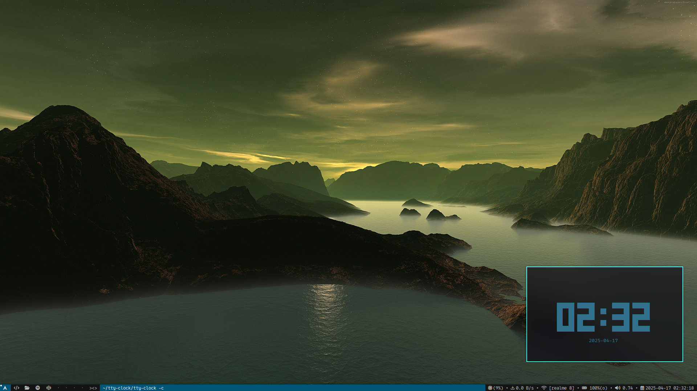

# Suckless
My Suckless DWM setup that sucks less. 

Be minimalistic :)

## Screenshots



## Installation

- Clone the repository :

```bash
git clone https://github.com/Pritamdhiman/Suckless.git
```
- Then make using :
```bash
sudo make clean install
```
- Add these to your .xinitrc
```bash
#!/bin/sh

slstatus &
exec dwm
```
